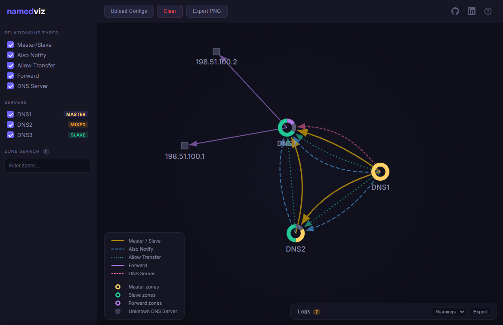

# namedviz

A visual analysis tool for BIND DNS infrastructure. Upload `named.conf` files from one or more DNS servers and get an interactive graph showing how all the includes and configurations connect to each other. It turns nested configuration complexity into an intuitive visual map so you can understand DNS structure in seconds instead of hours.



## Features

- **Master/Slave replication:** see which servers replicate zones from which masters
- **Also-Notify targets:** track zone change notification paths
- **Allow-Transfer permissions:** visualize AXFR/IXFR transfer rules
- **Forward zones:** identify zones delegated to external resolvers
- **Interactive graph:** drag, zoom, hover for details, click for full info
- **Sidebar filters:** filter by relationship type, server, or zone name
- **Export:** save the diagram as PNG
- **Upload or pre-load:** drag and drop configs in the browser, or point to a directory on disk

## Installation

Requires Python 3.10+.

```bash
pip install -e ".[dev]"
```

## Usage

### Upload mode (browser)

```bash
python run.py
```

Open http://localhost:5000, click **Upload Configs**, add one `named.conf` per server, and click **Parse & Visualize**.

### Pre-load from directory

```bash
python run.py path/to/configs/
```

The directory should contain one subdirectory per server, each with a `named.conf` file:

```
server1/
  named.conf
server2/
  named.conf
```

Sample configs are included for a quick demo:

```bash
python run.py sample_configs/
```

## Architecture

```
namedviz/
  parser/
    loader.py        File discovery + include resolution
    grammar.py       pyparsing grammar for named.conf
    extractor.py     Parse results → ServerConfig dataclasses
  models.py          Dataclasses: Zone, ServerConfig, Relationship, GraphData
  graph.py           Builds D3-ready JSON from parsed configs
  app.py             Flask app factory
  api.py             REST API endpoints
  static/            Frontend SPA (plain JS + D3 v7)
```

**Parser pipeline:** config files are discovered by `loader.py`, parsed with a pyparsing grammar (`grammar.py`), and extracted into dataclass models (`extractor.py` → `models.py`). The `graph.py` module resolves relationships between servers and produces D3-ready node/link JSON served by the Flask API.

**Frontend:** plain JavaScript (no framework, no bundler) with D3.js v7 loaded from CDN. Uses IIFE modules (`Graph`, `Legend`, `Export`) and a dark theme with CSS custom properties.

## API Endpoints

| Method | Path | Description |
|--------|------|-------------|
| `GET` | `/api/graph` | D3-ready graph JSON (nodes, links, zones, servers) |
| `GET` | `/api/zones` | Zone list with optional `?server=`, `?type=`, `?name=` filters |
| `GET` | `/api/server/<name>` | Full detail for a single server |
| `POST` | `/api/upload` | Upload `named.conf` files (multipart form data) |
| `POST` | `/api/parse` | Re-parse configs from a directory path |

## Running Tests

```bash
pytest tests/
```

Test fixture configs are in `tests/confdata/`.

## Tech Stack

- **Backend:** Python 3.10+, Flask, pyparsing
- **Frontend:** D3.js v7, plain JavaScript, CSS custom properties
- **Tests:** pytest
